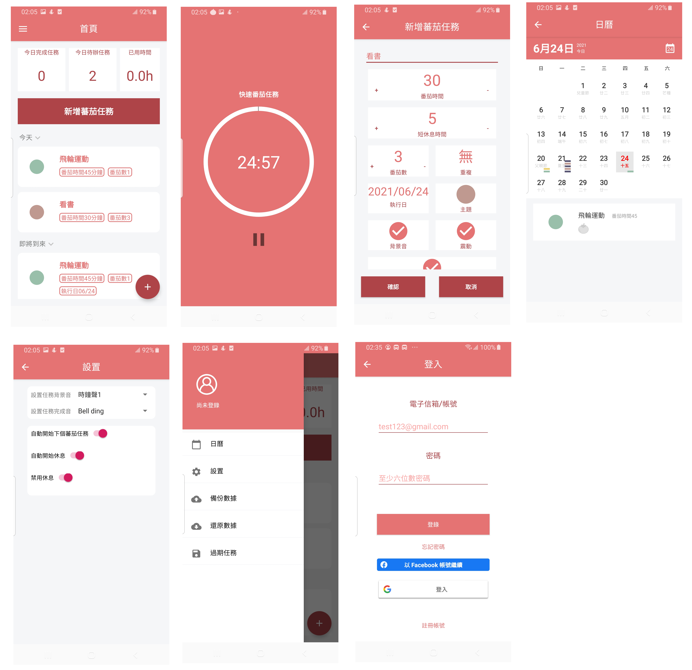

# Pomodoro timer
###### This is my practice android application.
###### Its use for management tasks.

- [x] Offer Google, Facebook, and email account sign-in.
- [x] The calendar shows mission operation status.
- [x] Set mission repeat mode, ex: every day or define repeat interval.
- [x] Choose mission background and finished ringtone.
- [x] Choose mission time and break time by yourself.
- [x] Offer a quick mission feature. Can operate mission directly without setup mission attribute.
- [x] Can backup and restore mission data after sign-in.
- [x] Auto-sync remote data after sign-in.
 
## Images

## Links

You can download test version [here](https://drive.google.com/file/d/1aCQ_0F08ftO9vxWDw-HYG3VKDfCFPi0J/view?usp=sharing).
